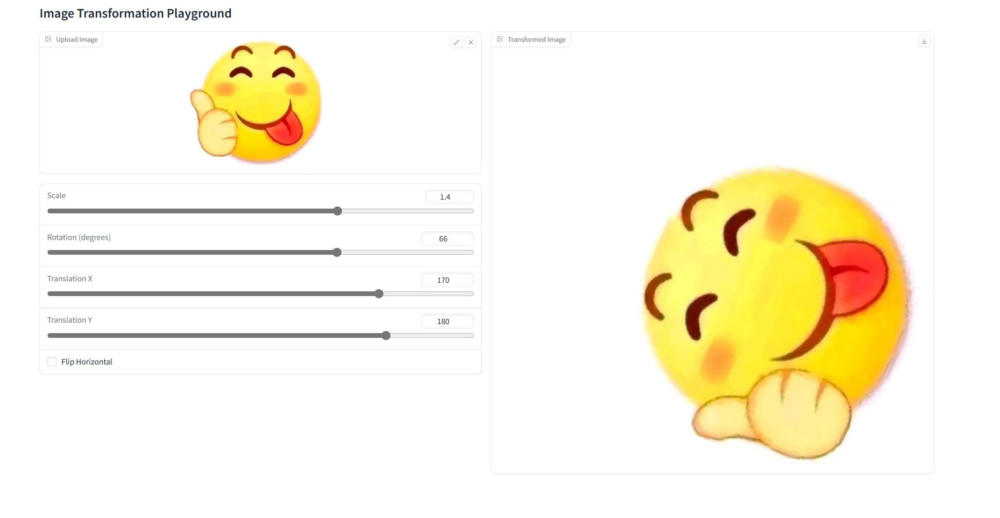
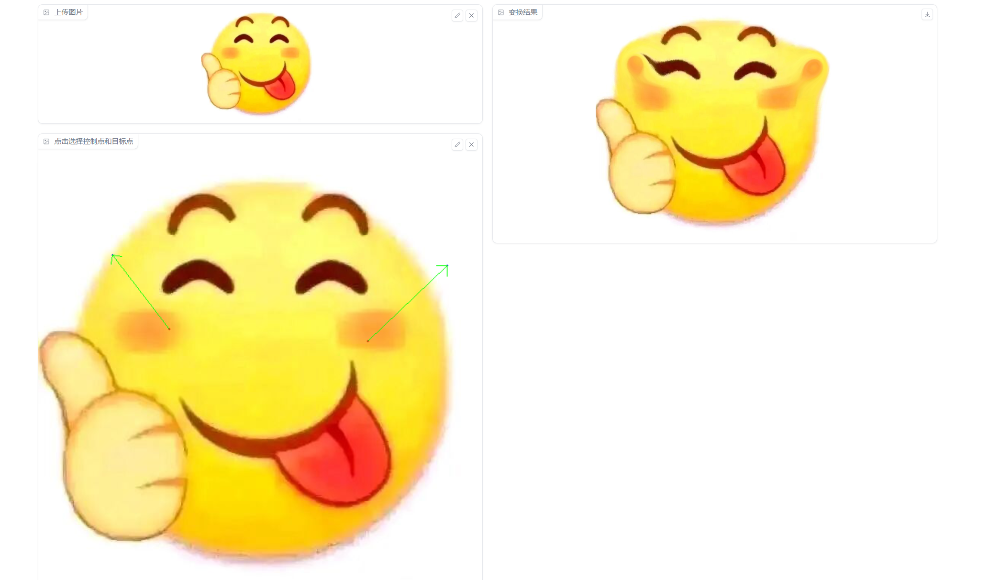

# 图像变形项目

本项目旨在通过径向基函数（RBF）实现图像变形，将源图像中的像素根据指定的变形规则映射到新的位置，从而生成变形后的图像。

## 项目描述

图像变形是一种图像处理技术，它可以用于图像校正、图像配准、特效制作等多种应用场景。本项目使用Python语言，结合NumPy和SciPy库，实现了基于RBF的图像变形算法。

## 使用方法

1. 确保你的环境中安装了Python，以及NumPy和SciPy库。
2. 将源图像文件放置在项目目录下的 `images` 文件夹中。
3. 运行 脚本，指定源图像文件名和目标点坐标。
4. 查看变形后的图像结果。

## 结果展示

以下是源图像和变形后图像的对比：

### 仿射变换

### RBF

## 注意事项

- 请确保输入的源图像和目标点坐标是正确的。
- 本项目仅作为图像变形的示例，可能需要根据实际需求进行调整和优化。

## 贡献

欢迎对本项目进行贡献。如果你有任何建议或发现问题，请提交Issue或Pull Request。

