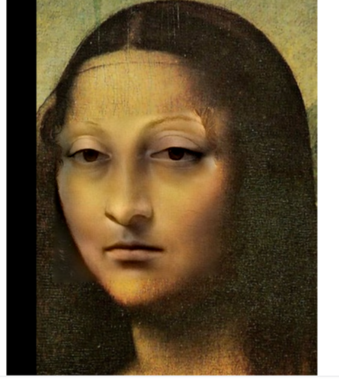
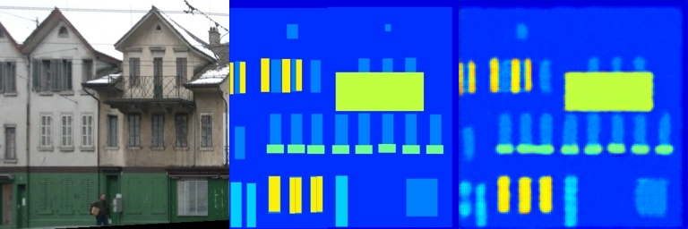
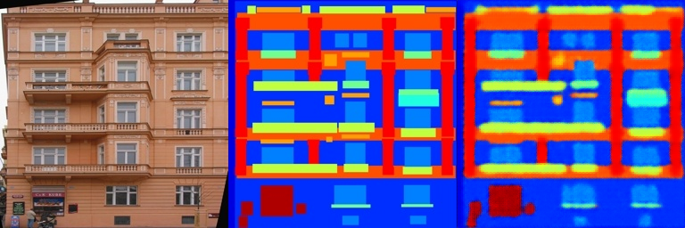
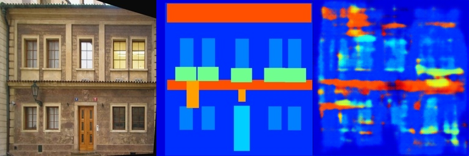
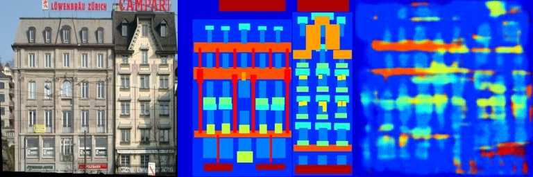
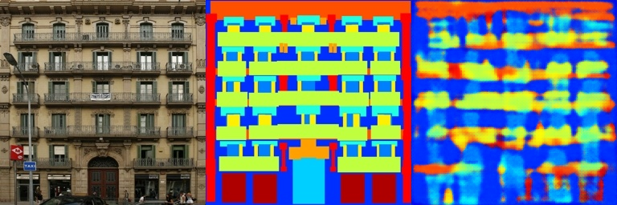
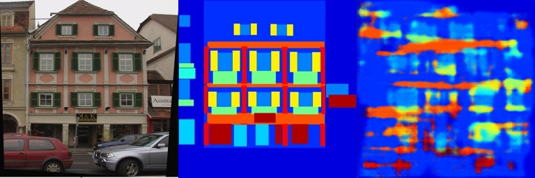
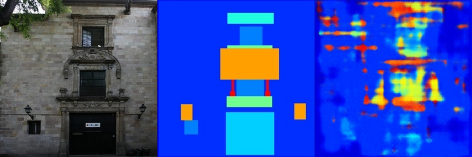

# hw2

泊松图像编辑和基于深度学习的图像编辑（Pix2Pix）与PyTorch。

## 项目描述

泊松图像编辑是一种允许以协调的方式编辑图像的技术，使得更改能够在整个图像中传播，同时保留原始图像的整体结构和外观。

Pix2Pix是一种用于图像到图像翻译任务的条件生成对抗网络（cGAN）。它特别适用于图像分割、风格迁移等任务。Pix2Pix学习将输入图像映射到输出图像，允许将一个图像转换为另一个图像。

## 使用方法

1. 确保你的环境中安装了Python，以及NumPy和SciPy等一些常见库。
2. 将源图像文件放置在项目目录下的 `images` 文件夹中。
3. 运行 脚本，指定源图像文件名和目标点坐标。
4. 查看处理后的图像结果。

## 结果展示

泊松融合结果展示：

pix2pix模型训练结果展示,经过800步训练，loss降到0.3

train result

val result

## 注意事项

- 请确保输入的源图像和目标点坐标是正确的。
- 本项目仅作为图像变形的示例，可能需要根据实际需求进行调整和优化。

## 贡献

欢迎对本项目进行贡献。如果你有任何建议或发现问题，请提交Issue或Pull Request。
