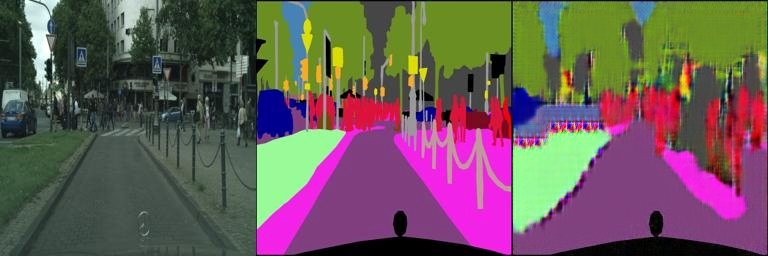
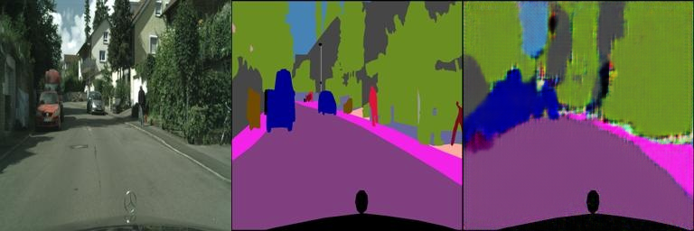
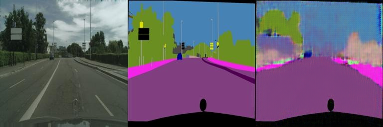
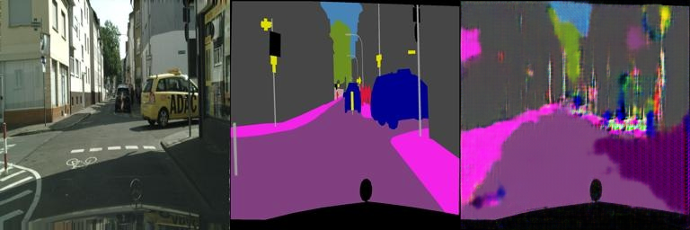
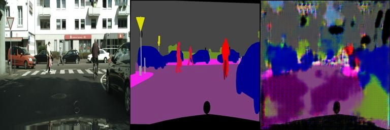
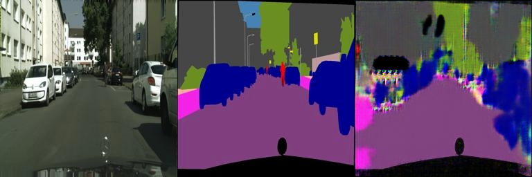
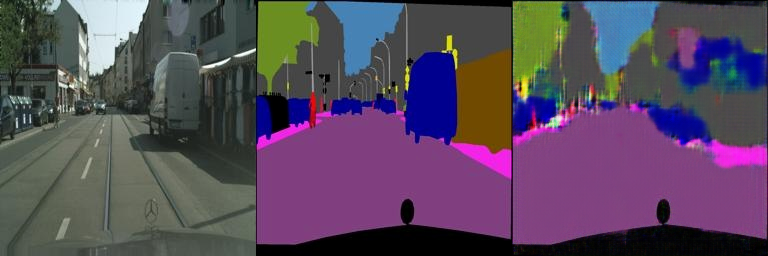

# hw3

play with gan
## part1
## 项目描述

increment hw2 with discriminative loss ，即利用gan网络重构作业2，期望达到更好的效果
## 使用方法

1. 确保你的环境中安装了Python，以及NumPy和SciPy等一些常见库。
2. 将源图像文件放置在项目目录下的 `images` 文件夹中。
3. 运行 脚本，指定源图像文件名和目标点坐标。
4. 查看处理后的图像结果。

## 结果展示

训练集结果展示
经过1500步

验证集结果展示，采取与训练集相同的配置

## 注意事项

- 请确保输入的源图像和目标点坐标是正确的。
- 本项目仅作为图像变形的示例，可能需要根据实际需求进行调整和优化。

## 贡献

欢迎对本项目进行贡献。如果你有任何建议或发现问题，请提交Issue或Pull Request。
